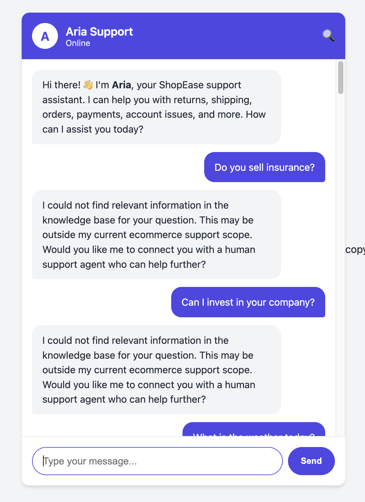

## 📸 Application Preview

### Aria Support Chatbot UI


# Aria Ecommerce RAG Chatbot

Aria is a production-oriented Retrieval-Augmented Generation chatbot for ecommerce customer support. It answers ShopEase support questions using a JSON FAQ knowledge base, MiniLM dense embeddings, ChromaDB vector search, LangChain prompt orchestration, FastAPI APIs, conversation memory, escalation rules, and hallucination-safe retrieval gates.

The system is intentionally scoped to ecommerce support: returns, refunds, shipping, order tracking, payments, coupon issues, account support, damaged products, and related customer care workflows.

## 1. Project Title

**Aria Ecommerce RAG Chatbot**

A hallucination-safe GenAI support assistant for ecommerce FAQ automation.

## 2. Project Overview

Aria helps customers get fast answers to common ecommerce support questions while avoiding unsupported answers. The chatbot retrieves factual policy information from `knowledge/knowledge_base.json`, validates that the retrieved content is relevant, and then generates or templates a final answer.

The project demonstrates a practical RAG system with:

- FastAPI backend and REST endpoints
- LangChain prompt and model orchestration
- ChromaDB persistent vector database
- `sentence-transformers/all-MiniLM-L6-v2` embeddings
- JSON FAQ knowledge base
- One FAQ equals one semantic chunk
- Cosine similarity retrieval
- Conversation memory and follow-up rewriting
- Rule-based escalation and frustration handling
- Confidence filtering and semantic validation for hallucination prevention
- Pytest production scenario coverage

## 3. Problem Statement

General LLM chatbots can sound confident even when they do not know the answer. In customer support, this creates real risk:

- A bot may invent refund timelines.
- A bot may answer unrelated questions from weak nearest-neighbor matches.
- A vague follow-up like "What about international orders?" may lose the previous topic.
- Emotional customers may receive cold factual responses.
- Escalation-worthy cases may stay trapped in automation.

Aria solves this by grounding responses in a curated ecommerce FAQ knowledge base and rejecting unsupported queries before generation.

## 4. Solution Overview

Aria uses Retrieval-Augmented Generation:

1. The user asks a question.
2. The pipeline detects intent and emotional state.
3. Conversation memory checks whether the message is a follow-up.
4. Follow-ups are rewritten into standalone questions.
5. MiniLM converts the query into a dense vector embedding.
6. ChromaDB retrieves semantically similar FAQ chunks using cosine similarity.
7. The retriever reranks and validates results.
8. Low-confidence or semantically mismatched results are rejected.
9. If no relevant FAQ remains, Aria returns `NO_MATCH`.
10. If a relevant FAQ exists, the LLM or template layer answers using only retrieved context.

## 5. Features

- **Hallucination prevention** with domain restriction, confidence thresholds, and semantic relevance validation.
- **Semantic retrieval** for paraphrases like "send my shoes back" matching return policy.
- **Follow-up understanding** using session memory, previous category, and previous retrieved intent.
- **Query rewriting** for ambiguous questions.
- **Category-aware retrieval boosting** for memory-preserving follow-ups.
- **Semantic reranking** using lexical, category, and intent signals on top of ChromaDB scores.
- **Empathy injection** for frustrated customers.
- **Escalation handling** for fraud, legal threats, severe frustration, damaged products, and human-agent requests.
- **Response completeness validation** for empty, truncated, or malformed output.
- **Debug tracing** for rewritten queries, scores, rejected chunks, fallback reasons, and escalation reasons.
- **Pytest coverage** for retrieval, hallucination, follow-up, frustration, and escalation scenarios.

## 6. Tech Stack

| Layer | Technology | Purpose |
| --- | --- | --- |
| API | FastAPI | Chat, health, stats, and debug endpoints |
| Orchestration | LangChain | Prompt templates and LLM invocation |
| Vector DB | ChromaDB | Persistent FAQ vector search |
| Embeddings | all-MiniLM-L6-v2 | 384-dimensional sentence embeddings |
| Retrieval | Cosine similarity | Dense semantic matching |
| Knowledge base | JSON | Structured FAQ entries, tags, aliases, answers, escalation flags |
| LLM | Groq API (`llama-3.3-70b-versatile`) | Query rewriting and grounded response generation |
| Memory | Custom session memory | Conversation history, category, intent, frustration count |
| Frontend | HTML, CSS, vanilla JS | Lightweight chat UI and debug panel |
| Tests | pytest, pytest-asyncio | Production scenario validation |
| Env manager | uv | Reproducible Python dependency setup |

## 7. High-Level Architecture Diagram

```text
Frontend UI
   |
   v
FastAPI /api/chat
   |
   v
LangChain RAG Pipeline
   |
   +--> Intent detection
   +--> Conversation memory
   +--> Query rewriting
   +--> MiniLM embeddings
   +--> ChromaDB semantic retrieval
   +--> Cosine similarity search
   +--> Confidence filtering and semantic validation
   +--> Escalation checks
   +--> Groq API (llama-3.3-70b-versatile)
   |
   v
Final AI Response + debug trace + retrieval logs
```

## 8. Detailed RAG Pipeline Flow

```text
User Query
  |
  v
Intent Detection
  |
  v
Conversation Memory
  |
  v
Query Rewriting
  |
  v
MiniLM Embedding Generation
  |
  v
ChromaDB Semantic Search
  |
  v
Cosine Similarity Matching
  |
  v
Top-K Retrieval
  |
  v
Semantic Reranking
  |
  v
Confidence Filtering
  |
  v
Semantic Validation
  |
  +--> NO_MATCH fallback when unsafe
  |
  v
Groq API Generation
  |
  v
Final AI Response
```

Step-by-step:

1. **User Query**: The customer sends a message to `/api/chat`.
2. **Intent Detection**: `IntentService` classifies greeting, farewell, FAQ query, frustration, escalation, or no-match candidates.
3. **Conversation Memory**: `SessionMemoryManager` loads previous turns, last retrieved category, last retrieved intent, and frustration count.
4. **Query Rewriting**: Follow-ups are rewritten with context. Example: "What about international orders?" becomes "What is the international return policy?"
5. **MiniLM Embedding Generation**: The query is converted into a 384-dimensional dense vector.
6. **ChromaDB Semantic Search**: ChromaDB searches FAQ vectors for nearest semantic matches.
7. **Cosine Similarity Matching**: Results are scored from weak to strong relevance.
8. **Top-K Retrieval**: The retriever fetches a wider internal candidate set, reranks it, and returns only the configured top results.
9. **Confidence Filtering**: Results below `MIN_ANSWER_CONFIDENCE` are rejected.
10. **Semantic Validation**: The system checks domain relevance, category alignment, intent alignment, keyword overlap, and memory alignment.
11. **Generation**: The LLM receives only validated retrieved context. If no safe context exists, Aria returns a no-match fallback.
12. **Final AI Response**: The response is returned with intent, retrieval, generation, escalation, session, and pipeline trace metadata.

Groq is now the only LLM provider in the project. MiniLM is not used for response generation; it is used only for embeddings and semantic retrieval. The previous on-machine LLM runtime was removed to simplify deployment, reduce startup checks, and make the runtime architecture easier to operate.

## 9. Semantic Retrieval Explanation

Semantic retrieval finds meaning, not just exact keywords.

Keyword search may fail when the customer says:

```text
Can I send my shoes back?
```

The FAQ might say:

```text
What is your return policy?
```

Traditional keyword search may not connect "send back" with "return policy". Dense semantic retrieval can connect them because the embedding model places semantically similar sentences near each other in vector space.

Aria still adds guardrails on top of semantic retrieval because nearest-neighbor search will always return something unless filtered. A weak nearest FAQ is not always a valid answer.

## 10. Embedding Architecture

Embeddings are numeric representations of text. MiniLM converts each question, answer, tag, category, and alias into a vector.

Aria uses:

```text
sentence-transformers/all-MiniLM-L6-v2
```

Why MiniLM:

- Compact and fast
- 384-dimensional vectors
- Good semantic similarity performance
- Suitable for local ecommerce FAQ retrieval
- Works well with ChromaDB cosine search

At startup, Aria builds semantic chunks from the JSON knowledge base and embeds each chunk. At query time, Aria embeds the user message and searches for nearby FAQ vectors.

## 11. ChromaDB Vector Search

ChromaDB stores the FAQ embeddings on disk in `chroma_db/`.

Startup flow:

```text
knowledge/knowledge_base.json
  -> semantic chunk text
  -> MiniLM embeddings
  -> ChromaDB collection
  -> persistent local vector index
```

Query flow:

```text
User query
  -> MiniLM query vector
  -> ChromaDB similarity_search_with_relevance_scores()
  -> candidate FAQ chunks
```

ChromaDB is used because it is simple, local, persistent, and works well for a compact FAQ corpus.

## 12. Semantic Chunking

Aria uses semantic chunking where **one FAQ object equals one chunk**.

Each chunk combines:

- Question variants
- Tags
- Semantic aliases
- Category
- Intent
- Answer
- Escalation metadata when relevant

Why not split by token windows:

- FAQ entries are already complete semantic units.
- Splitting one FAQ into fragments can separate the answer from the policy context.
- Customer support answers should retrieve complete procedures, not partial text.
- One FAQ equals one chunk makes debugging easier because each retrieved result maps to a real support topic.

Example chunk content:

```text
Q: What is your return policy?
Q: Can I send the item back?
Keywords: return, returns, refund, 30 days
Aliases: send back, return item, international return policy
Category: Returns & Refunds
Topic: Return Policy
Answer: You can return most items within 30 days...
```

## 13. Query Rewriting

Follow-up messages often omit context:

```text
Customer: What is your return policy?
Customer: What about international orders?
```

The second message is ambiguous by itself. Aria uses previous retrieved intent and category to rewrite it:

```text
What is the international return policy?
```

The rewrite can be deterministic for common ecommerce follow-ups and LLM-assisted when an LLM is available.

Tracked rewrite context:

- Previous query
- Previous category
- Previous retrieved FAQ intent
- Conversation history

## 14. Conversation Memory

Aria keeps per-session memory with two layers:

- **Conversation history** for prompt context
- **Session metadata** for retrieval and routing

Session metadata includes:

- `turn_count`
- `last_category`
- `last_intent`
- `frustration_count`
- `sentiment_trend`
- `escalation_history`
- lightweight turn history

This memory is used to detect follow-ups, preserve topic continuity, and escalate repeated frustration.

## 15. Follow-Up Handling

Follow-up detection uses:

- Phrases like "what about", "how about", "also", "and"
- Short questions after previous FAQ answers
- Pronoun references like "it", "that", "this"
- Ecommerce follow-up phrases like "international orders"

Retrieval then receives:

- Rewritten standalone query
- Previous category
- Previous intent

This lets the retriever boost relevant return, refund, shipping, or tracking chunks instead of drifting into unrelated FAQs.

## 16. Escalation System

Escalation is deterministic and separate from generation.

Escalation triggers include:

- Human agent request
- Legal threat
- Fraud or account security issue
- Damaged or defective product document flag
- Severe frustration
- Repeated frustration across the session

Example:

```text
User: I think someone hacked my account.
Intent: ESCALATION
Trigger: fraud_keyword
Urgency: critical
```

Escalation matters because some support problems should not be answered by a FAQ. They need human review, case tracking, or urgent handling.

## 17. Hallucination Prevention

Aria prevents hallucination through layered controls:

1. **Domain restriction**: Unsupported topics bypass retrieval.
2. **Confidence filtering**: Weak similarity matches are discarded.
3. **Semantic relevance validation**: Results must align with ecommerce domain, category, intent, keywords, or conversation memory.
4. **Strict prompt rules**: The LLM is instructed to answer only from retrieved context.
5. **No-match fallback**: If no safe context remains, Aria says it could not find relevant information.
6. **Response validation**: Empty or truncated responses fall back to template output.

Unsupported examples that return `NO_MATCH`:

```text
Do you sell insurance?
Can I invest in your company?
Can I buy Bitcoin?
What is the weather today?
Teach me machine learning
```

Fallback response:

```text
I could not find relevant information in the knowledge base for your question.
This may be outside my current ecommerce support scope.
Would you like me to connect you with a human support agent who can help further?
```

## 18. Confidence Filtering

The default production threshold is:

```bash
MIN_ANSWER_CONFIDENCE=0.55
```

This means a retrieved chunk must be sufficiently similar before it can be used.

Why confidence filtering matters:

- ChromaDB will return nearest neighbors even for unrelated questions.
- The nearest FAQ is not necessarily relevant.
- Low-score chunks can cause hallucinated or misleading answers.
- Rejecting weak matches is safer than pretending to know.

Aria also logs rejected chunk IDs and rejection reasons so retrieval quality can be audited.

## 19. Testing Architecture

The test suite uses `pytest` and `pytest-asyncio`.

Test categories:

- **Retrieval tests**: Confirm semantic aliases, typos, and expected FAQ intents.
- **Hallucination tests**: Confirm unsupported topics return `NO_MATCH`.
- **Escalation tests**: Confirm fraud, legal, and human-agent requests escalate.
- **Frustration tests**: Confirm emotional language is detected and repeated frustration escalates.
- **Follow-up tests**: Confirm memory detects contextual questions and rewrite behavior works when an LLM is available.
- **Pipeline tests**: Confirm end-to-end component initialization and integrated behavior.

Example hallucination scenarios:

```text
Do you sell insurance?        -> NO_MATCH
Can I invest in your company? -> NO_MATCH
Can I buy Bitcoin?            -> NO_MATCH
What is the weather today?    -> NO_MATCH
Teach me machine learning     -> NO_MATCH
```

Example retrieval scenarios:

```text
Can I send my shoes back? -> RETURN_POLICY
Where is my money?        -> REFUND_STATUS
trak my pakage            -> TRACK_ORDER
wrong item recieved       -> WRONG_ITEM
I threw away the box      -> NO_BOX
```

## 20. Folder Structure

```text
.
├── app/
│   ├── api/
│   │   └── chat.py
│   ├── chains/
│   │   └── rag_chain.py
│   ├── embeddings/
│   │   └── minilm.py
│   ├── memory/
│   │   └── session_memory.py
│   ├── models/
│   │   └── schemas.py
│   ├── prompts/
│   │   └── templates.py
│   ├── retrievers/
│   │   └── chroma_retriever.py
│   ├── services/
│   │   ├── escalation_service.py
│   │   ├── intent_service.py
│   │   ├── llm_service.py
│   │   ├── pipeline_service.py
│   │   └── preprocessor.py
│   └── vectorstore/
│       └── chroma_store.py
├── frontend/
│   ├── index.html
│   ├── script.js
│   └── style.css
├── knowledge/
│   └── knowledge_base.json
├── logs/
│   └── retrieval_evals.jsonl
├── tests/
│   ├── conftest.py
│   ├── escalation_tests.py
│   ├── followup_tests.py
│   ├── frustration_tests.py
│   ├── hallucination_tests.py
│   ├── retrieval_tests.py
│   └── test_pipeline.py
├── .env.example
├── pyproject.toml
├── server.py
├── uv.lock
└── README.md
```

## 21. Installation Guide

Prerequisites:

- Python 3.10+
- `uv`
- Groq API key for LLM-powered query rewriting and response generation

Install `uv`:

```bash
pip install uv
```

Clone or open the project directory:

```bash
cd /path/to/Aria
```

Install dependencies:

```bash
uv sync
```

## 22. UV Environment Setup

Aria uses `uv.lock` for reproducible dependency resolution.

Create/update the virtual environment:

```bash
uv sync
```

Run commands inside the uv environment:

```bash
uv run python --version
uv run pytest tests -q
```

Create an environment file:

```bash
cp .env.example .env
```

Recommended `.env` values:

```bash
GROQ_API_KEY="your-groq-api-key"
GROQ_MODEL="llama-3.3-70b-versatile"
KB_PATH="knowledge/knowledge_base.json"
MIN_ANSWER_CONFIDENCE=0.55
TOP_K_RETRIEVAL=5
SESSION_TIMEOUT_SECONDS=1800
```

## 23. Running the Project

Start FastAPI:

```bash
uv run python server.py
```

Open the UI:

```text
http://localhost:8000
```

API docs:

```text
http://localhost:8000/docs
```

Aria uses Groq as the only LLM provider. If `GROQ_API_KEY` is not configured, deterministic responses and safe template fallbacks still work for supported cases, but LLM-assisted generation and non-deterministic rewrites require Groq.

## 24. API Endpoints

### `POST /api/chat`

Main chat endpoint.

Request:

```json
{
  "message": "What is your return policy?",
  "session_id": "demo-session"
}
```

Response shape:

```json
{
  "response": "You can return most items within 30 days...",
  "session_id": "demo-session",
  "intent": {
    "intent": "FAQ_QUERY",
    "confidence": 0.7,
    "sentiment": "neutral",
    "sentiment_score": 0.0,
    "meta": {}
  },
  "retrieval": {
    "results": [],
    "query_analysis": {}
  },
  "generation": {
    "source": "template",
    "model": "template",
    "tokens_used": 0,
    "rewritten_query": null
  },
  "escalation": {
    "should_escalate": false,
    "reason": "",
    "urgency": "none",
    "trigger": ""
  }
}
```

### `GET /api/health`

Returns component health:

```json
{
  "status": "healthy",
  "groq_available": true,
  "vectorstore_ready": true,
  "documents_indexed": 67,
  "active_sessions": 1
}
```

### `GET /api/stats`

Returns vector store, LLM, and session stats.

### `GET /api/debug/{session_id}`

Returns memory metadata for a session.

### `GET /`

Serves the browser chat UI.

## 25. Example Queries

Supported:

```text
What is your return policy?
What about international orders?
Where is my refund?
I am really frustrated. My refund still has not arrived.
How do I track my order?
trak my pakage
wrong item recieved
My payment failed
My item arrived damaged
I want to talk to a human
```

Unsupported:

```text
Do you sell insurance?
Can I invest in your company?
Can I buy Bitcoin?
What is the weather today?
Teach me machine learning
```

## 26. Debugging Features

Aria exposes multiple debugging surfaces:

- Frontend debug panel
- API response trace
- Retrieval analysis object
- Session debug endpoint
- JSONL retrieval evaluation logs

Debug fields include:

- Raw query
- Rewritten query
- Previous intent
- Previous category
- Similarity score
- Reranking boosts
- Semantic validation details
- Rejected chunk IDs
- Rejection reason
- Fallback trigger reason
- Escalation trigger
- Escalation reason
- Response validation result

## 27. Retrieval Evaluation Logs

Every processed request is appended to:

```text
logs/retrieval_evals.jsonl
```

Example log fields:

```json
{
  "raw_query": "Can I buy Bitcoin?",
  "augmented_query": null,
  "detected_intent": "NO_MATCH",
  "retrieved_chunks": [],
  "rejected_chunk_ids": [],
  "retrieval_rejection_reason": "out_of_domain:crypto",
  "fallback_trigger_reason": "out_of_domain:crypto",
  "top_confidence_score": 0.0,
  "final_response": "I could not find relevant information in the knowledge base..."
}
```

These logs are useful for:

- Auditing hallucination prevention
- Finding missing FAQ coverage
- Inspecting weak or rejected matches
- Evaluating follow-up rewrite quality
- Comparing retrieval scores over time

## 28. Current Limitations

- The knowledge base is FAQ-style JSON, not a full CMS.
- There is no paid external reranker; reranking is internal and lightweight.
- ChromaDB is local by default, not a distributed vector database.
- Session memory is in process, so it resets when the server restarts.
- The frontend is intentionally lightweight and does not use React.
- LLM output quality depends on Groq API availability and model behavior.
- The system is scoped to ecommerce support and intentionally rejects unsupported general knowledge.

## 29. Future Improvements

Potential upgrades that preserve the current architecture:

- Add an admin workflow for reviewing rejected queries.
- Add offline retrieval evaluation dashboards from `logs/retrieval_evals.jsonl`.
- Add optional cross-encoder reranking while keeping ChromaDB retrieval.
- Add persistent session memory using Redis or a database.
- Add structured FAQ versioning and approval workflow.
- Add multilingual query normalization.
- Add CI test matrix for retrieval thresholds.
- Add synthetic test generation for new FAQ entries.
- Add observability metrics for latency, no-match rate, escalation rate, and retrieval precision.

## 30. Conclusion

Aria is a grounded ecommerce RAG chatbot designed for practical support automation. It keeps the architecture simple and production-friendly: FastAPI, LangChain, ChromaDB, MiniLM embeddings, JSON FAQ chunks, conversation memory, escalation rules, and Groq-only generation support.

The most important design choice is safety. Aria does not answer every question just because a vector database can return a nearest neighbor. It validates domain relevance, semantic alignment, confidence, and conversation context before generating a response. When the knowledge base does not contain a reliable answer, Aria fails safely with `NO_MATCH`.

That makes the system suitable as a serious foundation for ecommerce customer support RAG workflows.
